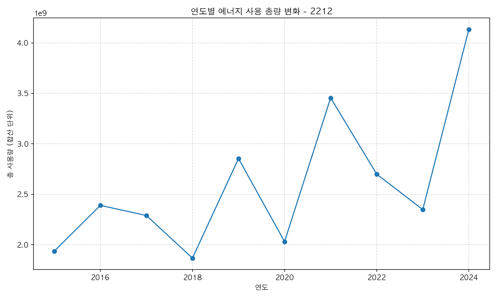
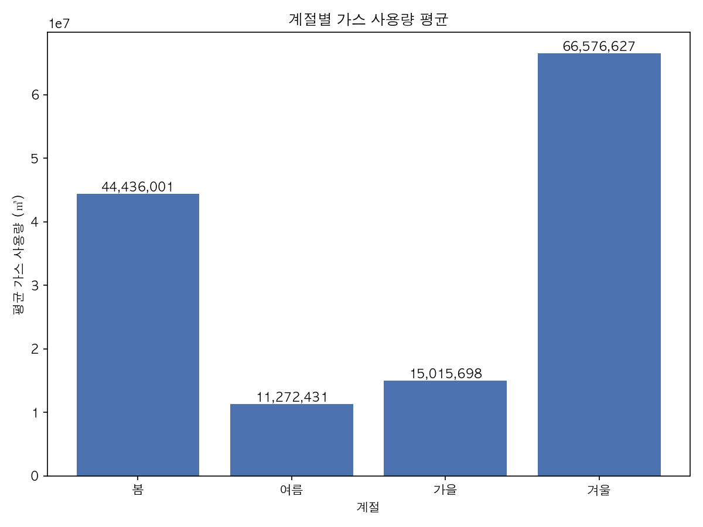

# Energy Usage Data Analysis with Seoul Open API

This project automates the collection, transformation, and visualization of Seoul Eco-Mileage energy usage statistics for the 개인 (household) category from January 2015 through December 2024. The annual line chart includes the student ID suffix `2212` in its title as required by the assignment brief.





## Project Layout
- `src/fetch_energy_data.py` — calls the Open API for each month and stores the raw JSON
- `src/preprocess.py` — converts JSON responses into a pandas DataFrame and prepares analysis-ready columns
- `src/visualize.py` — produces the annual total usage line chart and the seasonal gas usage bar chart
- `data/raw/` — raw API responses (JSON)
- `data/processed/` — processed datasets (CSV)
- `reports/figures/` — generated charts (PNG)
- `reports/analysis.md` — template for the 200-character analytical summary
- `docs/screenshots/` — drop in API key registration, script run logs, and graph previews
- `requirements.txt` — Python dependencies

## Setup
1. Install Python 3.9 or later.
2. (Optional) create and activate a virtual environment.
3. Install dependencies:
   ```bash
   pip install -r requirements.txt
   ```
4. Create a `.env` file in the project root and add your key:
   ```
   SEOUL_OPEN_API_KEY=REPLACE_WITH_YOUR_KEY
   ```

## Usage
1. **Collect data**
   ```bash
   python src/fetch_energy_data.py
   ```
   Saves one JSON file per month under `data/raw/`.

2. **Preprocess data**
   ```bash
   python src/preprocess.py
   ```
   Prints the assignment-specific outputs for Problems 2-1 and 2-2 and writes `data/processed/energy_usage_personal.csv`.

3. **Generate charts**
   ```bash
   python src/visualize.py
   ```
   Exports:
   - `reports/figures/annual_total_energy_2212.png`
   - `reports/figures/seasonal_gas_usage.png`

4. **Write the analysis**
   Update `reports/analysis.md` with a sub-200-character interpretation of the trends.

## Screenshots & Results
- `docs/screenshots/api_key.png` — API key issuance confirmation
- `docs/screenshots/fetch_run.png` — terminal output of the collection script
- `docs/screenshots/preprocess_run.png` — terminal output of the preprocessing script
- `docs/screenshots/visualize_results.png` — preview of the generated charts

Add or replace the placeholder files above with your actual screenshots when documenting the deliverables.
